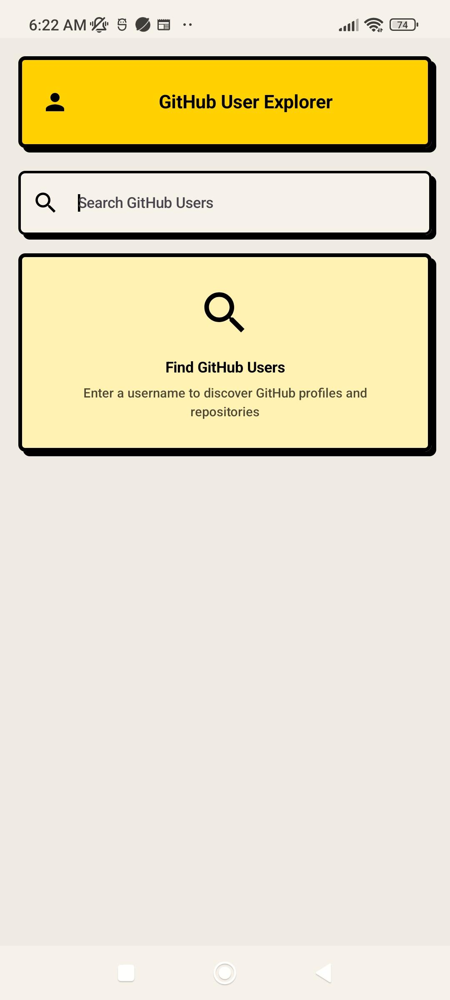
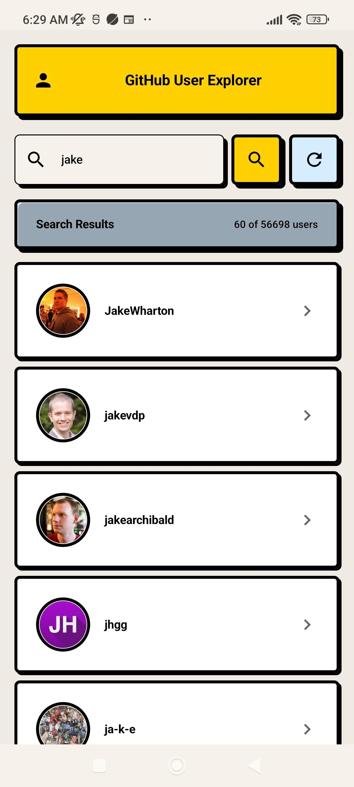
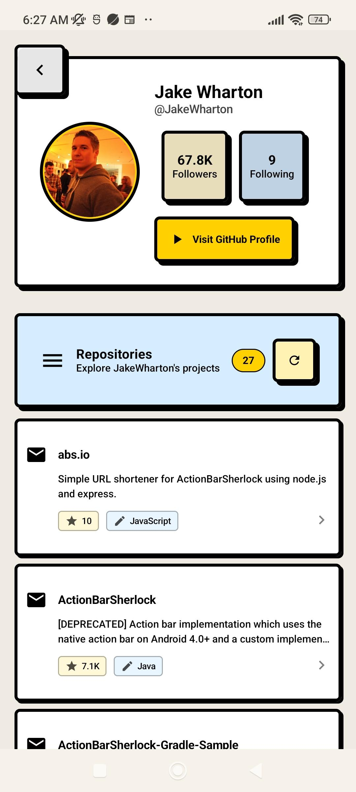

# GitHub User

A modern Android application that allows users to search and explore GitHub user profiles.

## Features

- Search for GitHub users
- View detailed user profiles
- Browse user repositories

## Tech Stack

- **Kotlin** - Primary programming language
- **Jetpack Compose** - Modern UI toolkit for building native Android UI
- **Hilt** - Dependency injection library
- **Retrofit** - Type-safe HTTP client for API communication
- **Coroutines & Flow** - For asynchronous programming
- **MVI Architecture** - Unidirectional data flow with immutable states and events

## Project Structure

The project follows a clean architecture approach with the following components:

- **data** - Contains repositories, data sources, and models
- **domain** - Contains use cases and domain models
- **ui** - Contains screens, view models, and UI components
- **di** - Contains dependency injection modules
- **common** - Contains utility classes and extensions

## Getting Started

### Prerequisites

- Android Studio Hedgehog or later
- JDK 11 or higher
- Android SDK 33+

### Setup

1. Clone the repository:

   ```
   git clone https://github.com/yourusername/GithubUser.git
   ```

2. Create a `local.properties` file in the root directory and add your GitHub API token:

   ```
   GITHUB_TOKEN=Bearer your_github_personal_access_token
   ```

3. Open the project in Android Studio and sync.

4. Build and run the app on an emulator or physical device.

## Screenshots

<div align="center">
  
  
  
</div>

## Acknowledgments

- [GitHub API](https://docs.github.com/en/rest) for providing the data
